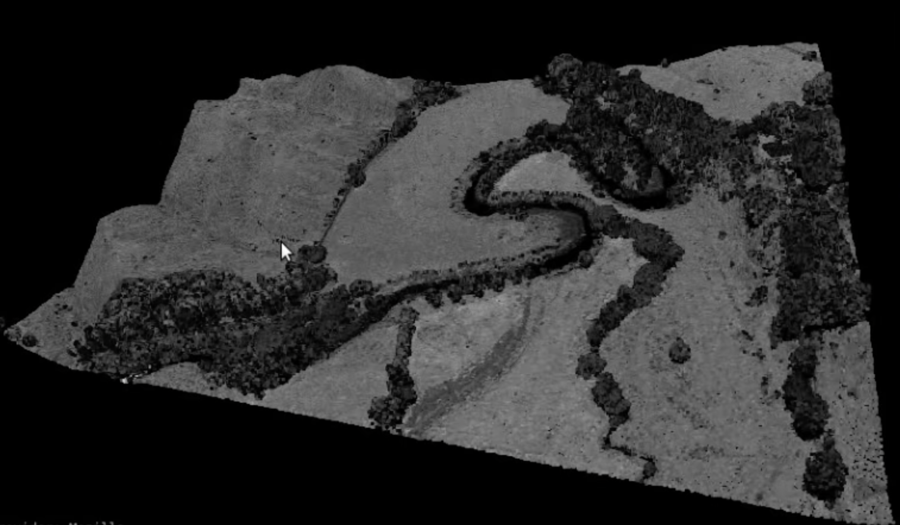
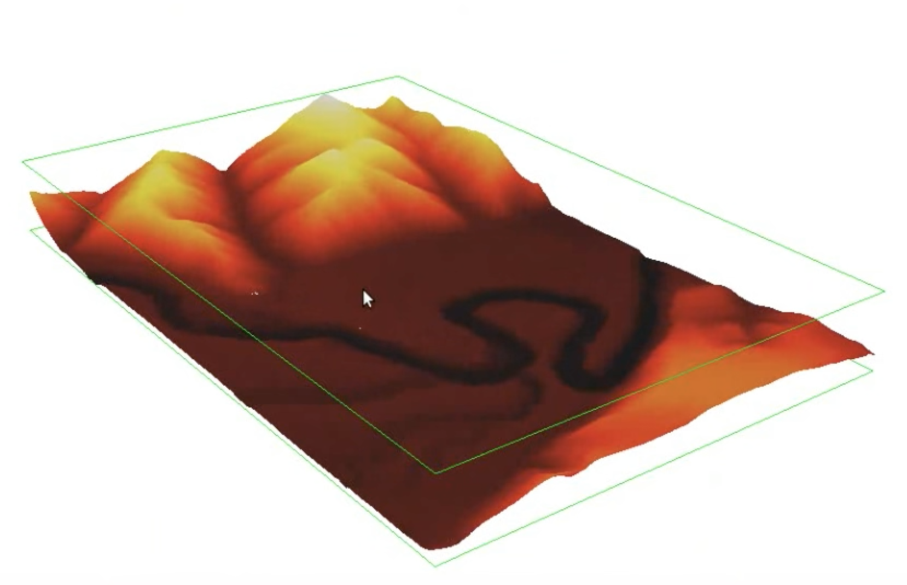
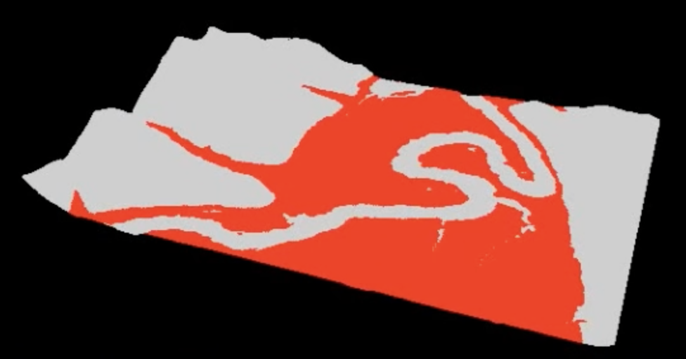
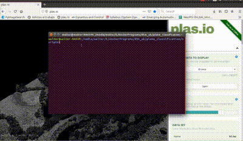
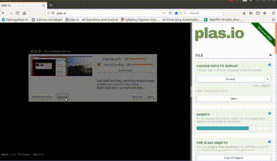

# Plane Classification

## Description

This project is an integral part of a larger initiative aimed at reconstructing 3D representations of crops. Our focus lies in utilizing point cloud data to distinguish between flat terrain and elevated areas, effectively categorizing them as plains and mountains. The primary objective is to identify suitable flat zones that vehicles can utilize for navigation across the terrain. This classification is crucial for optimizing navigation paths and ensuring safe and efficient traversal for vehicles operating within agricultural landscapes.

## Demostration

## Folder Configuration

